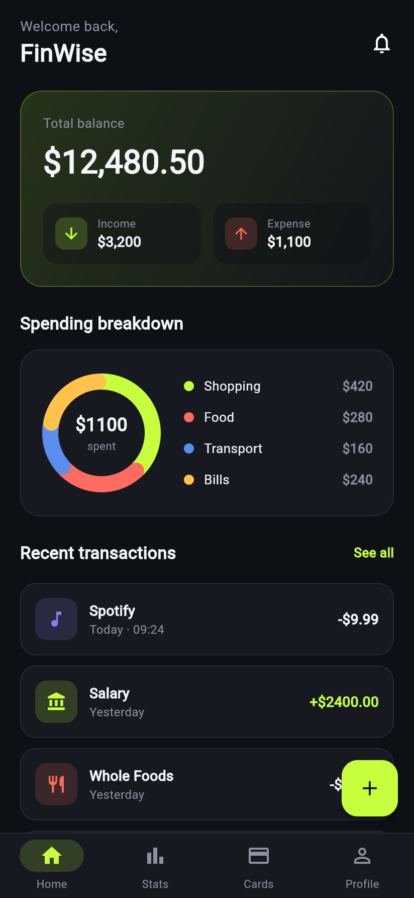

# FinWise

A clean **personal finance & expense tracker** app UI, built with **Flutter** for
iOS and Android.

FinWise shows how we present financial data on mobile — a clear balance card, a
spending breakdown drawn with a custom donut chart, and a readable transactions list.

<p align="center">
  
</p>

## Features

- **Balance card** — total balance with income / expense pills
- **Spending breakdown** — category donut chart drawn with a custom painter
- **Recent transactions** — colour-coded income and expenses
- **Quick add** — floating action button to log a new transaction
- **Bottom navigation** — Home, Stats, Cards and Profile

## Tech

- **Flutter** (Material 3), dependency-free codebase
- Custom `CustomPainter` donut chart for category spending
- Targets **Android** and **iOS** from one codebase

## Run it

```bash
flutter pub get
flutter run
```

---

© CABODEX LLC — mobile app development for iOS & Android · cabodex.com
